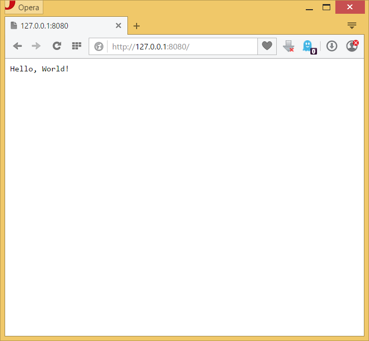
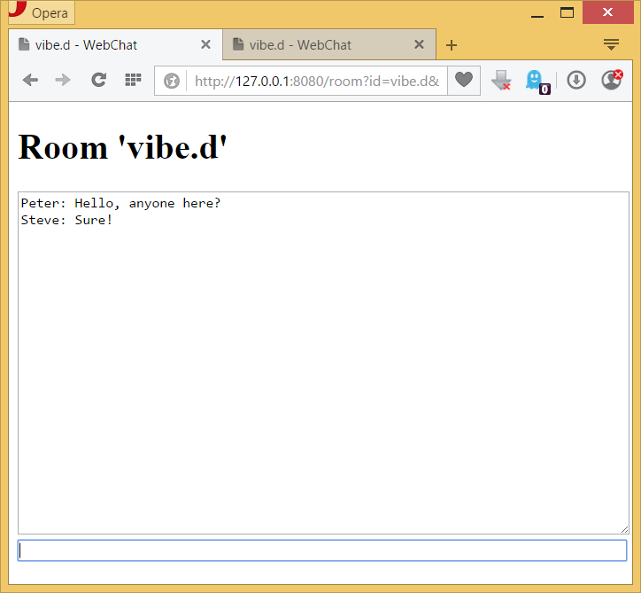

A D Tutorial: Writing a scalable chat service
=============================================

Introduction
------------

...

Contents
--------

1. [Why use D?](#why-use-d)
2. [Creating the project](#creating-the-project)
3. [Defining the basic application outline](#defining-the-basic-application-outline)
4. [Implementing a simple form based chat](#implementing-a-simple-form-based-chat)
5. [Incremental updates](#incremental-updates)
6. [Adding persistence](#adding-persistence)
7. [Enabling horizontal scaling](#enabling-horizontal-scaling)

Why use D?
----------

...

Creating the project
--------------------

We'll start off with invoking `dub init` on the command line:

	$ dub init webchat -t vibe.d
	Successfully created an empty project in 'C:\Users\sludwig\Develop\webchat'.

This has created very basic web application skeleton that starts up a HTTP server and shows a single welcome page. The source code is in `source/app.d`:

	import vibe.d;

	shared static this()
	{
		auto settings = new HTTPServerSettings;
		settings.port = 8080;
		settings.bindAddresses = ["::1", "127.0.0.1"];
		listenHTTP(settings, &hello);

		logInfo("Please open http://127.0.0.1:8080/ in your browser.");
	}

	void hello(HTTPServerRequest req, HTTPServerResponse res)
	{
		res.writeBody("Hello, World!");
	}

We can now run the application by simply invoking `dub` in the project directory:	

	$ cd webchat
	$ dub
	Performing "debug" build using dmd for x86.
	Target vibe-d 0.7.23+commit.102.g911b811 is up to date. Use --force to rebuild.
	Building webchat ~master configuration "application"...
	Linking...
	Copying files for vibe-d...
	Running .\webchat.exe
	Listening for HTTP requests on ::1:8080
	Listening for HTTP requests on 127.0.0.1:8080
	Please open http://127.0.0.1:8080/ in your browser.

Opening this address in the browser shows the following output:

Defining the basic application outline
--------------------------------------

Now that we have a basic web application running, we can start to add some additional request handlers. The first thing to do is to remove the `hello` function and add a class that will be registered as a [web interface][vibe-web] instead. To be able to use client side scripts and CSS files later, we'll also add a catch-all route that serves files in the `public/` folder:

	final class WebChat {
		// GET /
		void get()
		{
			render!"index.dt";
		}
	}

	shared static this()
	{
		// the router will match incoming HTTP requests to the proper routes
		auto router = new URLRouter;
		// registers each method of WebChat in the router
		router.registerWebInterface(new WebChat);
		// match incoming requests to files in the public/ folder
		router.get("*", serveStaticFiles("public/"));

		auto settings = new HTTPServerSettings;
		settings.port = 8080;
		settings.bindAddresses = ["::1", "127.0.0.1"];
		listenHTTP(settings, router);
		logInfo("Please open http://127.0.0.1:8080/ in your browser.");
	}

To make the page rendering work, we still have to add `index.dt` to the views folder and fill it with some content. The file is formatted as a [Diet][diet] template, which is a [Jade][jade] dialect based on embedded D instead of JavaScript. This format removes all of the usual syntax overhead that HTML has, mainly end tags and the angle brackets, making the code much more readable.

	doctype html
	html
		head
			title Welcome to WebChat
		body
			h1 Welcome to WebChat
			p Please enter the name of a chat room to join a chat:

			form(action="/room", method="GET")
				p
					label(for="id") Chat room:
					input#id(type="text", name="id", autofocus=true)
				p
					label(for="name") Your name:
					input#name(type="text", name="name")
				button(type="sumbit") Enter

Now, you may have noticed that the call to render the above template is using template arguments instead of normal parameters (denoted by the `!`). The reason for that is that the Diet templates are actually translated into HTML at compile time using D's powerful meta-programming abilities. This means that the code generated, even if there are dynamic elements inside (see the title tag in the following `room.dt` file), is always as fast as it gets - usually as fast as serving a static page from RAM.

Now, running `dub` and refreshing the browser now yields this:

Now let's create a new route in our `WebChat` class that handles the submitted form:

	void getRoom(string id, string name)
	{
		render!("room.dt", id, name);
	}

The name of this method is automatically mapped to a GET request for the path "/room". The `id` and `name` parameters mean that it will accept corresponding form fields passed through the query string. With the following `room.dt` file, we can then enter a chat room:

	doctype html
	html
		head
			title #{id} - WebChat
			style.
				textarea, input { width: 100%; }
		body
			h1 Room '#{id}'

			textarea#history(rows=20, readonly=true)
			form(action="room", method="POST")
				input(type="hidden", name="id", value=id)
				input(type="hidden", name="name", value=name)
				input#inputLine(type="text", name="message", autofocus=true)

Implementing a simple form based chat
-------------------------------------

We already have a form in our `room.dt`, so let's add a handler for it:

	void postRoom(string id, string message)
	{
		// TODO: store chat message
		redirect("room?id="~id.urlEncode~"&name="~name.urlEncode);
	}

To get a working prototype, let's first add a simple in-memory store of the message history. Rooms are created on-demand using the `getOrCreateRoom` helper method.

	final class Room {
		string[] messages;

		void addMessage(string name, string message)
		{
			messages ~= name ~ ": " ~ message;
		}
	}

	final class WebChat {
		private Room[string] m_rooms;

		// ...

		void getRoom(string id, string name)
		{
			auto messages = getOrCreateRoom(id).messages;
			render!("room.dt", id, name, messages);
		}

		void postRoom(string id, string name, string message)
		{
			getOrCreateRoom(id).addMessage(name, message);
			redirect("room?id="~id.urlEncode~"&name="~name.urlEncode);
		}

		private Room getOrCreateRoom(string id)
		{
			if (auto pr = id in m_rooms) return *pr;
			return m_rooms[id] = new Room;
		}
	}

Inside `room.dt`, we can now populate the `<textarea>` with messages from the history list:

	textarea#history(rows=20, readonly=true)
		- foreach (ln; messages)
			|= ln

And voilà, there go our first chat messages:

Incremental updates
-------------------

Now that we have a basic chat going, let's use some JavaScript and WebSockets to get incremental updates instead of reloading the whole page after each message. This will also give us immediate updates when other clients write messages, so that no manual page reloading is necessary. We start with a route to handle incoming web socket connections:

	// GET /ws?room=...&name=...
	void getWS(string room, string name, scope WebSocket socket)
	{
		auto r = getOrCreateRoom(room);

		runTask({
			auto next_message = r.messages.length;

			while (socket.connected) {
				while (next_message < r.messages.length)
					socket.send(r.messages[next_message++]);
				r.waitForMessage();
			}
		});

		while (socket.waitForData) {
			auto message = socket.receiveText();
			if (message.length) r.addMessage(name, message);
		}
	}

Inside of the handler, we first start a background task that will watch the `Room` for new messages and sends those to the connected WebSocket client. After that, we enter a loop to read all messages from the WebSocket. Each message is appended to the list of messages in that room.

For this to work we'll have to implement `Room.waitForMessage` and add a corresponding trigger to `addMessage`:

	final class Room {
		string[] messages;
		ManualEvent messageEvent;

		this()
		{
			messageEvent = createManualEvent();
		}

		void addMessage(string name, string message)
		{
			messages ~= name ~ ": " ~ message;
			messageEvent.emit();
		}

		void waitForMessage(size_t next_message)
		{
			while (messages.length <= next_message)
				messageEvent.wait();
		}
	}

`ManualEvent` is a simple entity that has a blocking `wait()` method (it lets other tasks run while waiting), which can be triggered using `emit`. Many tasks can wait on the same event at the same time.

Now that the backend is ready, we'll have to add some JavaScript to the frontend. The following file (`public/scripts/chat.js`) simply connects to our WebSocket endpoint and starts to listen for messages. Each message is appended to `<textarea>`'s contents. The `sendMessage` function will be the replacement for sending the chat message form. It sends the message over the WebSocket instead of submitting the form and then clears the message field for the next message.

	function sendMessage()
	{
		var msg = document.getElementById("inputLine")
		socket.send(msg.value);
		msg.value = "";
		return false;
	}

	function connect(room, name)
	{
		socket = new WebSocket("ws://127.0.0.1:8080/ws?room="+encodeURIComponent(room)+"&name="+encodeURIComponent(name));

		socket.onopen = function() {
			console.log("socket opened - waiting for messages");
		}

		socket.onmessage = function(message) {
			var history = document.getElementById("history");
			var previous = history.innerHTML.trim();
			if (previous.length) previous = previous + "\n";
			history.innerHTML = previous + message.data;
			history.scrollTop = history.scrollHeight;
		}

		socket.onclose = function() {
			console.log("socket closed - reconnecting...");
			connect();
		}

		socket.onerror = function() {
			console.log("web socket error");
		}
	}

This now gets integrated into `room.dt` by appending some script tags to the end of the `<body>` element:

	- import vibe.data.json;
	script(src="scripts/chat.js")
	script connect(!{Json(id)}, !{Json(name)})

Finally, the form needs have its `onsubmit` attribute set, so that the WebSocket code is used instead of actually submitting the form:

	form(action="room", method="POST", onsubmit="return sendMessage()")

And that's it, we now have a fast and efficient single-node multi-user chat. The only thing missing now is to add some persistence using an underlying database.

Adding persistence
------------------

The final step for completing this little chat application will be to add a persistent storage instead of the ad-hoc in-memory solution that we have so far. We'll be using Redis for this task, as it is a fast database that is very well suited for this kind of task, and because vibe.d conveniently includes a Redis client driver. The necessary setup looks like this:

	final class WebChat {
		private {
			RedisDatabase m_db;
			Room[string] m_rooms;
		}

		this()
		{
			m_db = connectRedis("127.0.0.1").getDatabase(0);
		}

		// ...
	}

Simple as that. Now let's replace the actual string array of messages with a `RedisList!string`:

	final class Room {
		RedisDatabase db;
		string id;
		RedisList!string messages;
		ManualEvent messageEvent;

		this(RedisDatabase db, string id)
		{
			this.db = db;
			this.id = id;
			this.messages = db.getAsList!string("webchat_"~id);
			this.messageEvent = createManualEvent();
		}

		void addMessage(string name, string message)
		{
			this.messages.insertBack(name ~ ": " ~ message);
			this.messageEvent.emit();
		}

		void waitForMessage(long next_message)
		{
			while (messages.length <= next_message)
				messageEvent.wait();
		}
	}

As we can see, the code still looks almost the same. `RedisList` will issue all the necessary Redis commands for appending and reading of the list entries.

Enabling horizontal scaling
---------------------------

Now that we have a fast and persistent chat service running, there is just one thing missing from the initial promise of this article: we need to enable the service to scale horizontally. With regards to the storage, this is easy to do by distributing the chat rooms across different Redis instances, for example by using [Redis Cluster][redis-cluster]. But we also need to handle the case where users connect to different instances of the web service and want to chat with each other. For that, the different instances need to be able to notify each other about new messages, so we have to extend the basic `ManualEvent` based notification mechanism.

Fortunately, Redis has a PubSub functionality that we can use here. It consists of named "channels" to which any client can send messages. All clients connected to the database can then subscribe to one or more of those channels and will each receive these messages. For our use case, to keep things simple, we are going to use a single channel to which we will send the names of the rooms that got new messages.

	final class Room {
		void addMessage(string name, string message)
		{
			this.messages.insertBack(name ~ ": " ~ message);
			this.db.publish("webchat", id);
		}
	}

	final class WebChat {
		private {
			// ...
			RedisSubscriber m_subscriber;
		}

		this()
		{
			// ...

			m_subscriber = RedisSubscriber(m_db.client);
			m_subscriber.subscribe("webchat");
			m_subscriber.listen((channel, message) {
				if (auto pr = message in m_rooms)
					pr.messageEvent.emit();
			});
		}

		// ...
	}

All that is necessary to make this work is to publish a message with the name of the chat room in `Room.addMessage` instead of directly triggering `messageEvent`, as well as setting up a subscriber for the PubSub channel. `subscriber.listen()` will start a new background task that waits for new messages to arrive in the "webchat" channel and then calls the delegate that we pass it for each message. Within this callback we simply trigger the `messageEvent` of the corresponding `Room`, and we are done.

Open topics
-----------

- Authentication
- Redis setup/multiple instances
- Benchmarking
- Timestamps
- Styling
- HTTP/2

[vibe-web]: http://vibed.org/api/vibe.web.web/
[diet]: http://vibed.org/templates/diet
[jade]: http://jade-lang.com/
[redis-cluster]: http://redis.io/topics/cluster-tutorial